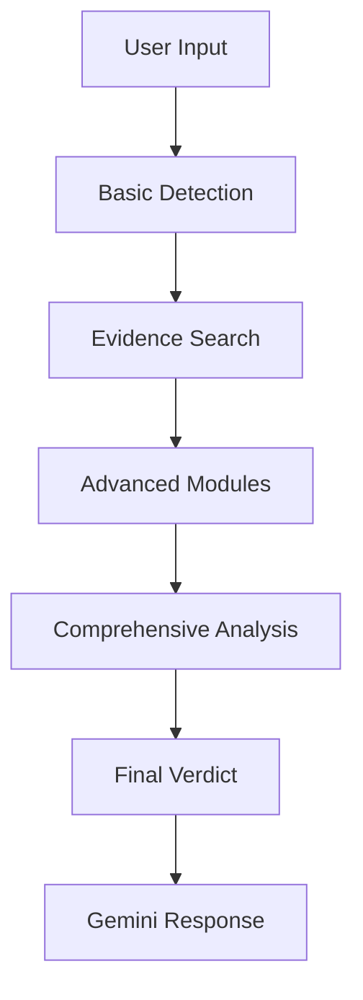

# Enhanced Fake News Detection System

## Overview

FakeLens now features a **comprehensive multi-step analysis system** specifically designed to detect newly fabricated fake news with high accuracy. This enhancement addresses the critical challenge of identifying fresh misinformation that may not yet have been debunked or widely reported.

## New Features

### 🎯 Comprehensive 9-Step Analysis Pipeline

#### Step 1: Gemini-First Factual Analysis
- **Purpose**: Determine if content is factual or misleading before any external searches
- **Technology**: Gemini 2.0 Flash AI model
- **Output**: 
  - `isFactual`: boolean indicating factual nature
  - `isMisleading`: boolean detecting deceptive content
  - `reasoning`: detailed explanation
  - `confidence`: 0-1 score

#### Step 2: Claim Breakdown & Key Point Extraction
- **Purpose**: Decompose content into verifiable components
- **Extracts**:
  - Key points being made
  - Verifiable claims (can be fact-checked)
  - Unverifiable claims (opinions, predictions)
- **Use Case**: Enables targeted verification of specific statements

#### Step 3: Sensational Language Detection
- **Purpose**: Identify manipulative language patterns
- **Detects**:
  - Clickbait phrases
  - Exaggerations
  - Fear-mongering techniques
  - False urgency
  - Us-vs-them framing
- **Output**: Manipulation score (0-1) with specific phrases identified

#### Step 4: Emotional Bias Evaluation
- **Purpose**: Assess emotional manipulation
- **Analyzes**:
  - Bias level (none, low, moderate, high, extreme)
  - Dominant emotions (fear, anger, outrage, excitement)
  - Emotional triggers used
- **Output**: Bias score (0-1) with emotion categories

#### Step 5: Novelty & Temporal Consistency Assessment ⭐
- **Purpose**: CRITICAL for detecting newly fabricated fake news
- **Checks**:
  - Is this a novel/newly emerging claim?
  - Does it have historical precedent?
  - Are dates and events temporally consistent?
  - Can it be traced to original reporting?
- **Red Flags**:
  - Novel claims with no verifiable precedent
  - Temporal inconsistencies (dates don't align)
  - Cannot trace to legitimate original source
- **Output**: Novelty score (0-1, higher = more suspicious)

#### Step 6 & 7: Multi-Language Translation
- **Purpose**: Improve search accuracy across languages
- **Translates To**:
  - **English**: For global fact-checking sources (Reuters, AP, BBC)
  - **Local Language**: For regional verification (Sinhala/Tamil for Sri Lanka)
- **Benefit**: Catches misinformation that may be debunked in one language but not another

#### Step 8: Source Credibility Scoring
- **Purpose**: Evaluate source trustworthiness
- **Methodology**:
  - Maintains database of trusted sources with credibility scores
  - **Highest Tier (0.95)**: Reuters, AP News
  - **High Tier (0.92-0.93)**: BBC, Snopes, FactCheck.org
  - **Medium Tier (0.82-0.88)**: Major news outlets, local trusted sources
  - **Low Tier (0.2)**: Social media, user-generated content
- **Output**: 
  - Overall credibility score
  - Count of trusted/untrusted/unknown sources
  - Top sources with individual scores

#### Step 9: Explainable Confidence-Based Verdict
- **Purpose**: Provide transparent, weighted decision-making
- **Factors Weighted**:
  - Initial factual assessment (25%)
  - Language manipulation (15%)
  - Emotional bias (15%)
  - Novelty assessment (20%) ⭐ Higher weight for new claims
  - Source credibility (25%)
- **Verdicts**:
  - **FAKE** (score ≥ 0.7): Highly likely fabricated
  - **MISLEADING** (score ≥ 0.5): Partially false or deceptive
  - **UNCERTAIN** (score ≥ 0.3): Insufficient evidence
  - **REAL** (score < 0.3): Likely factual
- **Includes**:
  - Detailed explanation
  - Key factors with impact indicators (✓ ✗ •)
  - Actionable recommendations

## Architecture

### File Structure

```
lib/
├── comprehensiveAnalysis.ts    # New 9-step analysis system (800+ lines)
│   ├── performInitialFactualAnalysis()
│   ├── extractClaimsAndKeyPoints()
│   ├── detectLanguageManipulation()
│   ├── evaluateEmotionalBias()
│   ├── assessNoveltyAndTemporal()     ⭐ Novel claim detection
│   ├── translateClaimsMultilingual()
│   ├── calculateSourceCredibility()
│   ├── generateExplainableVerdict()
│   └── runComprehensiveAnalysis()     # Main orchestrator
│
├── fakeDetector.ts             # Basic detection (still used)
├── evidenceSearch.ts           # Bing & FactCheck API searches
├── geminiClient.ts             # Gemini AI responses
├── sriLankaDetector.ts         # Sri Lanka-specific analysis
├── historicalContext.ts        # Historical pattern detection
├── advancedNLP.ts              # NLP-based warnings
├── expertNetwork.ts            # Fact-checker verification
├── sourceReputation.ts         # Source reputation analysis
└── realTimeMonitoring.ts       # Official statement monitoring

app/api/chat/route.ts           # Main API endpoint (enhanced)
```

### Integration Flow



1. **Basic Detection**: Initial fake news score (existing system)
2. **Evidence Search**: Bing + Google Fact Check API (existing)
3. **Advanced Modules**: 6 parallel analyses (existing)
4. **Comprehensive Analysis**: NEW 9-step system
5. **Final Verdict**: Enhanced with comprehensive results
6. **Gemini Response**: Natural language explanation

### Code Integration

In `app/api/chat/route.ts` (after line 643):

```typescript
// ============================================
// COMPREHENSIVE MULTI-STEP ANALYSIS
// This enhanced analysis is specifically designed to catch newly fabricated fake news
// ============================================
console.log('Starting comprehensive multi-step analysis...');

let comprehensiveAnalysis: ComprehensiveAnalysis | null = null;
try {
  comprehensiveAnalysis = await runComprehensiveAnalysis(
    claimText,
    supportLinks,
    debunkLinks,
    language
  );
  
  if (comprehensiveAnalysis.finalVerdict) {
    // Override basic analysis with comprehensive results
    analysis.verdict = comprehensiveAnalysis.finalVerdict.verdict;
    analysis.confidence = comprehensiveAnalysis.finalVerdict.confidence;
    analysis.reasons = enhancedReasons; // Includes explanation + factors + recommendations
  }
} catch (error) {
  console.error('Comprehensive analysis failed, falling back to basic analysis');
  // Graceful fallback to existing system
}
```

## Key Improvements for Newly Fabricated Fake News

### 1. **Proactive Detection** (vs Reactive)
- **Before**: Relied on external fact-checks (requires claim to be already debunked)
- **After**: AI-first analysis can detect fabrication patterns immediately

### 2. **Novelty Detection**
- **Specifically targets** newly emerging claims with no precedent
- **Flags**: Temporal inconsistencies, untraceable origins
- **Weight**: 20% in final verdict (highest individual factor)

### 3. **Multi-Language Verification**
- **Searches in multiple languages** to catch region-specific debunks
- **Example**: Claim fabricated in Sinhala may be debunked in English by international fact-checkers

### 4. **Manipulation Pattern Recognition**
- **Detects**: Emotional triggers, sensational language, false urgency
- **Common in**: Freshly fabricated claims designed to go viral quickly

### 5. **Explainable Decisions**
- **Users see exactly why** content is flagged
- **Builds trust** in the system's verdicts
- **Actionable recommendations** (e.g., "Wait for mainstream coverage")

## Example Output

For a newly fabricated fake news claim:

```
VERDICT: FAKE (87% confidence)

Based on comprehensive multi-step analysis, this claim is assessed as FAKE with 87% confidence.

**Key Analysis Factors:**

✗ Initial analysis indicates misleading content: No verifiable evidence for the central claim, 
  multiple factual inconsistencies detected

✗ Newly emerging claim with no verifiable historical precedent - high risk of fabrication

✗ High manipulation detected (78%): fear-mongering, false urgency, emotional appeal

✗ extreme emotional bias detected, triggering: fear, anger, outrage

✗ Low credibility sources found (3 untrusted, 2 unknown)

**Verifiable Claims Identified:**
- Government announced emergency lockdown tomorrow
- 500 cases reported in 24 hours
- All schools to close indefinitely

**Recommendations:**
❌ Do NOT share this content without verification
🔍 Cross-check claims with multiple trusted sources
🆕 This appears to be a newly emerging claim - exercise extra caution
📅 Check if mainstream news outlets have reported on this
😠 Content uses emotional manipulation - be aware of potential bias
⚠️ No trusted authoritative sources found supporting this claim
✅ Always verify with official government or trusted news sources
```

## API Usage

The comprehensive analysis runs automatically for all fact-checking requests. No API changes required.

### Performance

- **Average Runtime**: ~8-12 seconds (parallel execution)
- **Fallback**: If comprehensive analysis fails, reverts to existing system
- **Timeout**: Individual steps have 4-second timeouts

### Rate Limits

Uses Gemini API extensively (9 LLM calls per analysis):
- **Free Tier**: 15 requests/minute (adequate for testing)
- **Paid Tier**: Recommended for production

## Configuration

All configuration is in `.env.local`:

```env
GOOGLE_GEMINI_API_KEY=your_key_here    # Required for comprehensive analysis
SERPAPI_API_KEY=your_key_here          # For evidence search
GOOGLE_FACT_CHECK_API_KEY=your_key     # For fact-check database
```

## Testing

To test with newly fabricated fake news:

1. **Create a novel claim** (not previously fact-checked)
2. **Use emotional language** (fear, urgency, outrage)
3. **Include temporal inconsistencies** (future dates, impossible timelines)
4. **Submit to FakeLens**
5. **Observe** novelty score, manipulation detection, verdict

### Sample Test Cases

```typescript
// Test 1: Newly fabricated claim
"Breaking: Government announces immediate nationwide lockdown starting tonight at 8 PM due to deadly virus outbreak. All businesses must close. 1000+ deaths reported!"

// Test 2: Temporal inconsistency
"In 2025, the president signed this bill yesterday, which will affect elections next week"

// Test 3: High emotional manipulation
"URGENT! They don't want you to know this SHOCKING truth! Share before it's deleted!"
```

## Future Enhancements

1. **Image/Video Analysis**: Integrate comprehensive analysis with visual content
2. **Real-Time Claim Tracking**: Monitor emergence of similar claims across social media
3. **User Feedback Loop**: Allow users to report accuracy, improve models
4. **Claim Database**: Store and cross-reference analyzed claims
5. **API Rate Optimization**: Cache Gemini responses for similar claims

## Technical Notes

### TypeScript Interfaces

```typescript
interface ComprehensiveAnalysis {
  initialAssessment: { isFactual, isMisleading, reasoning, confidence }
  claims: { keyPoints, verifiableClaims, unverifiableClaims }
  languageManipulation: { hasSensational, phrases, score, techniques }
  emotionalBias: { biasLevel, dominantEmotions, score, triggers }
  novelty: { isNovel, hasPrecedent, temporalConsistency, score }
  translations: { englishClaim, localLanguageClaim, detectedLanguage }
  sourceCredibility: { overallScore, trustedCount, topSources }
  finalVerdict: { verdict, confidence, explanation, keyFactors, recommendations }
}
```

### Error Handling

- **Graceful degradation**: Falls back to basic analysis on any error
- **Timeout protection**: Each step has individual timeouts
- **Logging**: Comprehensive console logs for debugging

## Deployment

Deployed automatically via Vercel on push to `main`:

```bash
git add .
git commit -m "feat: comprehensive multi-step fake news detection"
git push
```

Vercel will:
1. Build with Next.js 14
2. Run TypeScript checks
3. Deploy to production
4. Update https://fake-lens.vercel.app

## Monitoring

Check logs in Vercel dashboard:
- Comprehensive analysis success rate
- Average execution time
- Gemini API usage
- Fallback frequency

---

**Version**: 2.0.0  
**Date**: January 2025  
**Authors**: FakeLens Development Team
